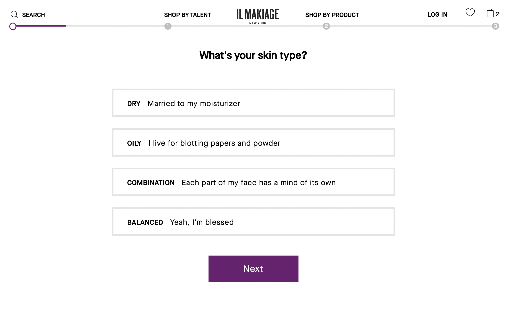

# Precedent Study

During the making of this project, this repository will be used to document any precedents that deserve noting and/or reflection. These <em>probably</em> won't be categorized in any specific way, but we'll see. Some of this will relate to various aspects of the project oncluding creation/modification menus, interactive toys, sonic qualities, etc. 

## [Mountain](https://www.davidoreilly.com/mountain)

David O'Reilly's mountain is a good starting precedent both in terms of the limited reflective interactions that you can do within the gameplay experience, but also from the initial questionnaire that informs the mountain creation. Goals beyond this would be to have the sounds be more variable based on the object's attributes (size, color, texture, etc)

## [Olli Olli World](https://store.privatedivision.com/en/game/olliolli-world)

They way that Olli Olli World has so many different (and even sometimes very <em>slightly</em> different) items is great. It's probably a little <em>too</em> expansive for the purpose of this project, but it makes the customization really fun. The "random body" and "random items" options are also perfect ways to explore the large amount of options they include.

## [Il Makiage](https://www.ilmakiage.com/powermatch-2-0-quiz-TBYB?cp)

Rilla mentioned Il Makiage's makeup colour matching tool as an interesting precedent here as well. Similar to the beginning of mountain, this uses text-based questions to come to a refined selection, which is definitely work exploring. There is something great about how these non-visually based decisions could then be used to create a visible item. There is also the opportunity for more esoteric/obfuscated questions to inform the item's creation. 